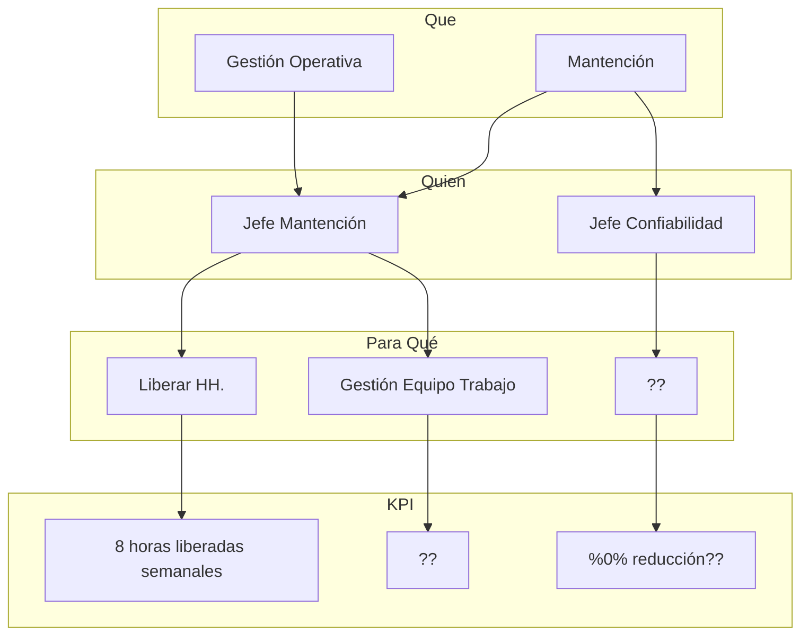
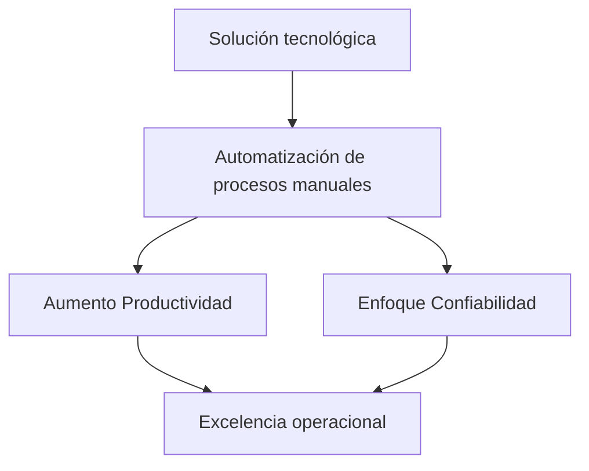
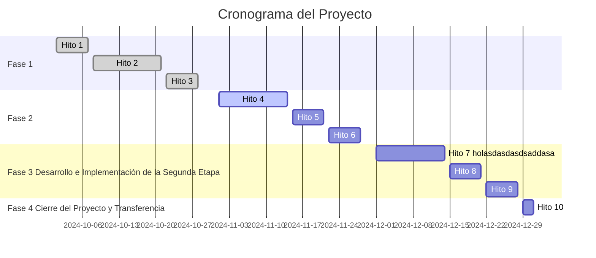
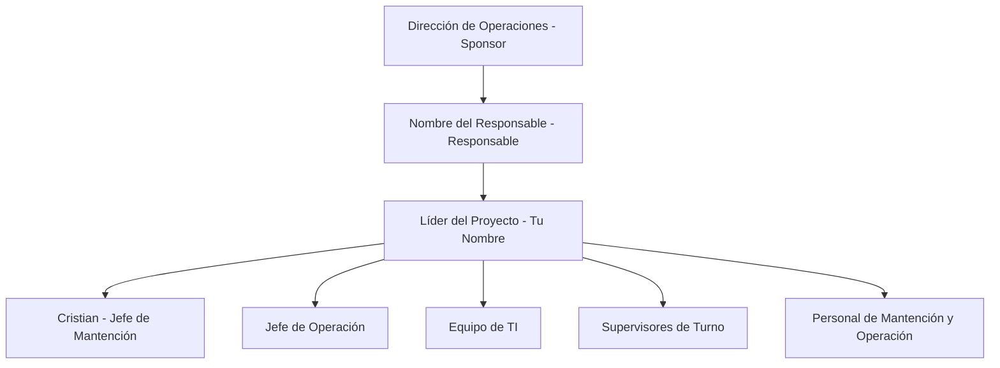

# Implementación de una Herramienta Digital para Automatizar Procesos Administrativos en Operación y Mantención

## Índice

- [Resumen Ejecutivo](#resumen-ejecutivo)
- [Objetivo del Proyecto](#objetivo-del-proyecto)
- [Descripción del Proyecto](#descripci%C3%B3n-del-proyecto)
- [Alcance del Proyecto](#alcance-del-proyecto)
- [Hitos y Entregables](#hitos-y-entregables)
- [Beneficios Cuantitativos](#beneficios-cuantitativos)
- [Equipo del Proyecto](#equipo-del-proyecto)
- [Conclusiones](#conclusiones)
- [Preguntas](#preguntas)

---

## Resumen Ejecutivo

La iniciativa propone implementar una **solución tecnológica** para automatizar procesos administrativos clave en las áreas de Operación. Al desarrollar una **herramienta digital integral**, se busca mejorar la eficiencia operativa y liberar al equipo de tareas manuales repetitivas. Esto permitirá enfocar recursos en actividades estratégicas que incrementen la confiabilidad y productividad, alineándose con los objetivos de excelencia operacional.

![[Pasted image 20241015203159.png]]

---

## Objetivo del Proyecto

Implementar una herramienta digital integral que automatice los procesos administrativos en las áreas de Operación y Mantención, específicamente en la **gestión de asistencia**, **asignación de recursos** y **registro de tareas**, mediante el desarrollo y despliegue de una solución tecnológica especializada.

---

## Descripción del Proyecto

### Situación Actual

- **Procesos Manuales y Repetitivos**: El Jefe de Mantención y su equipo enfrentan una carga administrativa significativa debido a procesos manuales en la gestión de asistencia, asignación de camas y turnos, cálculo de FTE y registro de tareas operativas.
- **Problemas Asociados**:
    - Consumo excesivo de tiempo.
    - Propensión a errores e inconsistencias.
    - Limitación para enfocarse en actividades estratégicas.

### Solución Propuesta

Desarrollar e implementar una **herramienta digital integral** en dos etapas:

#### Primera Etapa: Automatización de Gestión de Asistencia y Recursos

- **Gestión de Asistencia**: Automatización del registro de asistencia del personal.
- **Asignación de Camas y Turnos**: Asignación automatizada y eficiente.
- **Cálculo de FTE**: Cálculo automático basado en turnos y organigramas.
- **Generación de Reportes Estándar**: Formatos requeridos por el Contract Owner, como la curva de poblamiento en formato MEL.

#### Segunda Etapa: Registro y Organización de Tareas Operativas

- **Registro de Tareas en el Taller**: Registro directo por parte del personal técnico.
- **Centralización de Información**: Consolidación de datos en una base accesible para análisis y toma de decisiones.

---

## Alcance del Proyecto

### Incluido

| **Incluido**                                                  |
| ------------------------------------------------------------- |
| Desarrollo e implementación de la herramienta digital.        |
| Primera Etapa: Gestión de asistencia, asignación de recursos. |
| Segunda Etapa: Registro y organización de tareas operativas.  |
| Integración con sistemas y formatos actuales (formato MEL).   |
| Capacitación al personal en el uso de la herramienta.         |
| Pruebas en terreno y soporte post-implementación.             |

### Excluido

|**Excluido**|
|---|
|Implementación en áreas no relacionadas con Operación y Mantención.|
|Desarrollo de infraestructura de hardware adicional.|
|Funcionalidades no definidas en este proyecto.|

---

## Hitos y Entregables

### Cronograma del Proyecto

mermaid

Copiar código

### Detalles de los Hitos

#### Hito 1: Inicio del Proyecto y Formación del Equipo

- **Fecha**: Primera semana de octubre.
- **Entregables**:
    - Documento de conformación del equipo con roles y responsabilidades.
    - Plan de proyecto y cronograma general.
    - Agenda de reuniones y plan de comunicación.

#### Hito 2: Levantamiento de Requerimientos y Análisis de Procesos

- **Fecha**: Segunda y tercera semana de octubre.
- **Entregables**:
    - Documento detallado de requerimientos funcionales y técnicos.
    - Mapeo de procesos actuales y propuesta de mejora.
    - Especificaciones para el desarrollo de la herramienta.

_... (continúa con los demás hitos como en el documento anterior)_

---

## Beneficios Cuantitativos

### KPIs y Metas

|**KPI**|**Meta**|
|---|---|
|Reducción del tiempo en tareas administrativas|**50%**|
|Mejora en eficiencia de asignación de recursos y turnos|**30%**|
|Disponibilidad inmediata de información estructurada|**100%**|
|Horas-hombre liberadas|Medir tiempo ahorrado|
|Reducción de errores administrativos|Disminuir inconsistencias|
|Nivel de adopción de la herramienta|> **90%** del personal|
|Mejora en organización de tareas|Eficiencia en ejecución|

---

## Equipo del Proyecto

## Conclusiones

_Prompt para DALL·E: "Ilustración profesional de un equipo de trabajo celebrando el éxito de un proyecto tecnológico en un entorno industrial."_

- **Mejora en Eficiencia Operativa**: Automatización de procesos clave.
- **Reducción de Carga Administrativa**: Liberando tiempo para actividades estratégicas.
- **Aumento de Confiabilidad y Productividad**: Información estructurada y accesible.
- **Alineación Estratégica**: Con los objetivos de excelencia operacional.
- **Compromiso del Equipo**: Colaboración entre todas las áreas involucradas.

---
