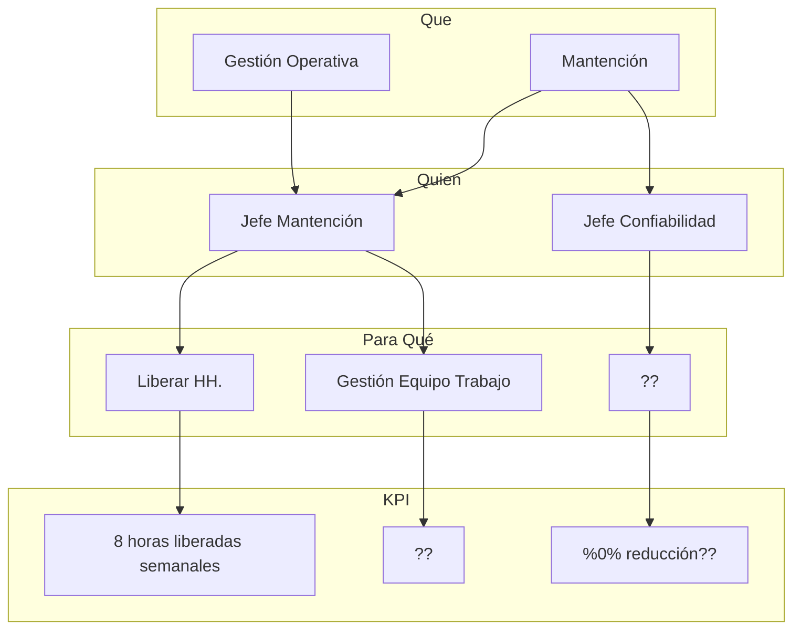
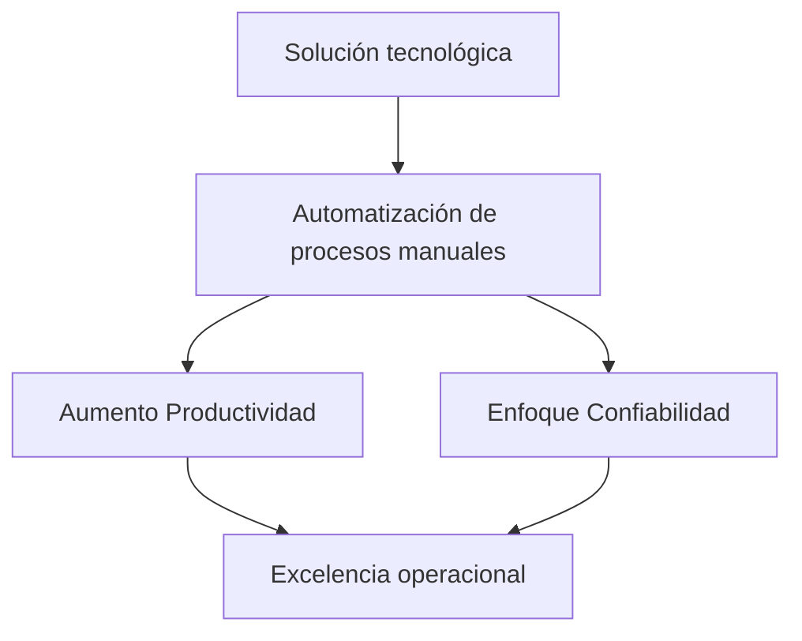
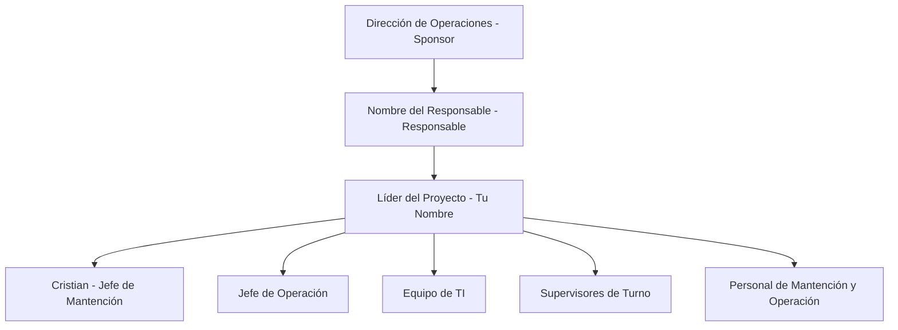

# Implementación de una Herramienta Digital para Automatizar Procesos Administrativos en Operación y Mantención

Can you help me visualizing this admin seletor? please ensure to write the whole code. I need you to edit this i made a change in the data structure. First of all, there is no supervisor, instead we have two hierarchy in personasPredefinidas, first categoria, which functionally remains the same, then instead of having a supervisor, a sub category must be shown (just like you have in supervisor). The funcionality remains quite the same, the naming changes. The new personas Predef dict is as follows: [ { "nombre": "Sebastian Cepeda", "cargo": "Asesor Técnico", "categoria": "N", "subcategoria": "N3", "habitacion": null, "cama": null, "id": "sebastian.cepeda" }, { "nombre": "Luis Ocacional", "cargo": "PSG", "categoria": "MN", "subcategoria": "OCACIONAL", "habitacion": null, "cama": null, "id": "luis.ocacional" }, { "nombre": "Victor Lucero", "cargo": "Asesor Técnico", "categoria": "M", "subcategoria": "OCACIONAL", "habitacion": null, "cama": null, "id": "victor.lucero" }, { "nombre": "Cecil Vega", "cargo": "Jefe Confiabilidad", "categoria": "MN", "subcategoria": null, "habitacion": null, "cama": null, "id": "cecil.vega" }, { "nombre": "Pablo Franulovich Robles", "cargo": "Supervisor", "categoria": "M", "subcategoria": "M1", "habitacion": 506, "cama": "ventana", "id": "pablo.franulovich" }, { "nombre": "Marco Birkner Vargas", "cargo": "Técnico", "categoria": "M", "subcategoria": "M1", "habitacion": 550, "cama": "ventana", "id": "marco.birkner" }, { "nombre": "Peter Ruiz Guarachi", "cargo": "Supervisor", "categoria": "N", "subcategoria": "N1", "habitacion": 507, "cama": "ventana", "id": "peter.ruiz" }, { "nombre": "Fernando Rey Cerda", "cargo": "Técnico", "categoria": "N", "subcategoria": "N1", "habitacion": 550, "cama": "pasillo", "id": "fernando.rey" } ]

REMOVE the header, and REMOVE the footer and REMOVE the sidetab.
KEEP categorias and cargo, the overall UI should feel exactly the same.


## Índice

- [Resumen Ejecutivo](#resumen-ejecutivo)
- [Objetivo del Proyecto](#objetivo-del-proyecto)
- [Descripción del Proyecto](#descripci%C3%B3n-del-proyecto)
- [Alcance del Proyecto](#alcance-del-proyecto)
- [Hitos y Entregables](#hitos-y-entregables)
- [Beneficios Cuantitativos](#beneficios-cuantitativos)
- [Equipo del Proyecto](#equipo-del-proyecto)
- [Conclusiones](#conclusiones)
- [Preguntas](#preguntas)



---

## Resumen Ejecutivo




La iniciativa propone implementar una **solución tecnológica** para automatizar procesos administrativos clave en las áreas de Operación. Al desarrollar una **herramienta digital integral**, se busca mejorar la eficiencia operativa y liberar al equipo de tareas manuales repetitivas. Esto permitirá enfocar recursos en actividades estratégicas que incrementen la confiabilidad y productividad, alineándose con los objetivos de excelencia operacional.


![[Pasted image 20241015203159.png]]


---

## Objetivo del Proyecto

Implementar una herramienta digital integral que automatice los procesos administrativos en las áreas de Operación y Mantención, específicamente en la **gestión de asistencia**, **asignación de recursos** y **registro de tareas**, mediante el desarrollo y despliegue de una solución tecnológica especializada.

---

## Descripción del Proyecto

### Situación Actual

- **Procesos Manuales y Repetitivos**: El Jefe de Mantención y su equipo enfrentan una carga administrativa significativa debido a procesos manuales en la gestión de asistencia, asignación de camas y turnos, cálculo de FTE y registro de tareas operativas.
- **Problemas Asociados**:
    - Consumo excesivo de tiempo.
    - Propensión a errores e inconsistencias.
    - Limitación para enfocarse en actividades estratégicas.

### Solución Propuesta

Desarrollar e implementar una **herramienta digital integral** en dos etapas:

#### Primera Etapa: Automatización de Gestión de Asistencia y Recursos

- **Gestión de Asistencia**: Automatización del registro de asistencia del personal.
- **Asignación de Camas y Turnos**: Asignación automatizada y eficiente.
- **Cálculo de FTE**: Cálculo automático basado en turnos y organigramas.
- **Generación de Reportes Estándar**: Formatos requeridos por el Contract Owner, como la curva de poblamiento en formato MEL.

#### Segunda Etapa: Registro y Organización de Tareas Operativas

- **Registro de Tareas en el Taller**: Registro directo por parte del personal técnico.
- **Centralización de Información**: Consolidación de datos en una base accesible para análisis y toma de decisiones.

---

## Alcance del Proyecto

### Incluido

| **Incluido**                                                  |
| ------------------------------------------------------------- |
| Desarrollo e implementación de la herramienta digital.        |
| Primera Etapa: Gestión de asistencia, asignación de recursos. |
| Segunda Etapa: Registro y organización de tareas operativas.  |
| Integración con sistemas y formatos actuales (formato MEL).   |
| Capacitación al personal en el uso de la herramienta.         |
| Pruebas en terreno y soporte post-implementación.             |

### Excluido

|**Excluido**|
|---|
|Implementación en áreas no relacionadas con Operación y Mantención.|
|Desarrollo de infraestructura de hardware adicional.|
|Funcionalidades no definidas en este proyecto.|

---

## Hitos y Entregables

### Cronograma del Proyecto


```mermaid
gantt
  dateFormat  YYYY-MM-DD
  title       Cronograma del Proyecto

  section Fase 1: Inicio del Proyecto y Desarrollo del MVP
  Hito 1: Kickoff del Proyecto           :done,    h1, 2024-10-01,2024-10-22
  Hito 2: Entrega de MVP para Gestión de Asistencia :active,    h2, 2024-10-23,2024-10-31
  
  section Fase 2: Transformación de Data en Formato MEL
  Hito 3: Desarrollo de Planillas Útiles           :         h3, 2024-11-01,2024-11-14
  Hito 4: Validación y Ajustes del Formato MEL     :         h4, 2024-11-15,2024-11-21
  
  section Fase 3: Implementación del Módulo de Registro de Tareas
  Hito 5: Desarrollo del Módulo de Registro de Tareas       :         h5, 2024-12-01,2024-12-14
  Hito 6: Pruebas y Validación del Módulo                   :         h6, 2024-12-15,2024-12-21
  Hito 7: Entrega Final del Proyecto y Transferencia        :         h7, 2024-12-22,2024-12-31

```

### Detalles de los Hitos

#### Hito 1: Kickoff del Proyecto

- **Fecha**: 1 al 22 de octubre.
- **Entregables**:
    - Reuniones de inicio con todos los stakeholders.
    - Cronograma y plan de ejecución del proyecto.
    - Diagnóstico del problema inicial. Mas de una perdida de falta productivo.

#### Hito 2: Entrega de MVP para Gestión de Asistencia

- **Fecha**: 23 al 31 de octubre.
- **Entregables**:
    - Versión inicial funcional de la herramienta que permita la gestión de asistencia.
    - Módulo de administrador para configuración básica y control de acceso.
    - Registro de asistencia operativa con funcionalidades básicas.

#### Hito 3: Desarrollo de Planillas Útiles en Formato MEL

- **Fecha**: 1 al 14 de noviembre.
- **Entregables**:
    - Herramienta de transformación de datos en planillas en formato MEL.
    - Generación de reportes estándares necesarios para la gestión operativa.

#### Hito 4: Validación y Ajustes del Formato MEL

- **Fecha**: 15 al 21 de noviembre.
- **Entregables**:
    - Ajustes y validaciones en base a retroalimentación.
    - Confirmación de alineación con requisitos.

#### Hito 5: Desarrollo del Módulo de Registro de Tareas

- **Fecha**: 1 al 14 de diciembre.
- **Entregables**:
    - Módulo adicional para el registro directo de tareas por el personal técnico.

#### Hito 6: Pruebas y Validación del Módulo de Registro de Tareas

- **Fecha**: 15 al 21 de diciembre.
- **Entregables**:
    - Pruebas de funcionalidad y estabilidad.

#### Hito 7: Entrega Final del Proyecto y Transferencia

- **Fecha**: 22 al 31 de diciembre.
- **Entregables**:
    - Implementación final del sistema completo.
    - Capacitación y documentación para el equipo.
    - Plan de soporte post-implementación.
---

## Beneficios Cuantitativos

### KPIs y Metas

|**KPI**|**Meta**|
|---|---|
|Reducción del tiempo en tareas administrativas|**50%**|
|Mejora en eficiencia de asignación de recursos y turnos|**30%**|
|Disponibilidad inmediata de información estructurada|**100%**|
|Horas-hombre liberadas|Medir tiempo ahorrado|
|Reducción de errores administrativos|Disminuir inconsistencias|
|Nivel de adopción de la herramienta|> **90%** del personal|
|Mejora en organización de tareas|Eficiencia en ejecución|

---

## Equipo del Proyecto





## Conclusiones

- **Mejora en Eficiencia Operativa**: Automatización de procesos clave.
- **Reducción de Carga Administrativa**: Liberando tiempo para actividades estratégicas.
- **Aumento de Confiabilidad y Productividad**: Información estructurada y accesible.
- **Alineación Estratégica**: Con los objetivos de excelencia operacional.
- **Compromiso del Equipo**: Colaboración entre todas las áreas involucradas.

---
